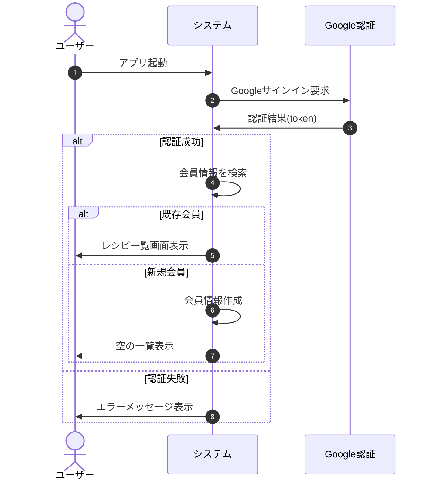
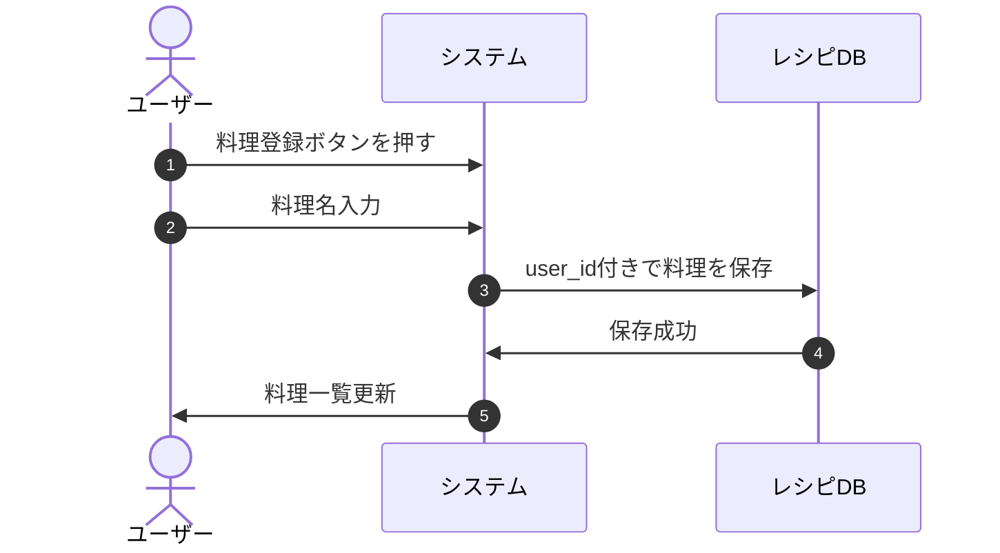
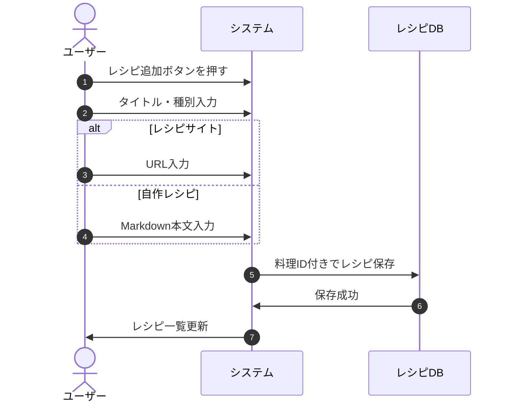

## テーマ
同じ料理に対して、複数のレシピサイトや、レシピを覚えておきたいことがある。それらを登録でき、即座に参照できるようなモバイルアプリが欲しい

## 課題定義

## 要件定義
### 機能要件
優先度
	- P0: 必須
	- P1: ここまで実装することを想定
	- P2: 可能であれば実装したい

#### ログイン機能
- 会員登録(P1)
- Googleアカウントでログイン(P1)
- ログイン状態でのみ、以下の機能が利用できる。
	- 料理名の登録(P0)
	- レシピサイトの登録、削除(P0)
	- 自作レシピの作成、markdownでの編集、削除(P0)

#### レシピ情報
- 料理はレシピを持たない状態でも登録可能とする(P0)
- 1つの料理に対して、複数のレシピを紐づけて管理できる(P0)
- レシピサイトへのリンク(P0)
- 自作レシピの場合は、タイトル、本文(P0)
- 本文には以下のテンプレートあり(P2)
	- レシピ名
	- 材料
	- 作り方
- レシピ一覧は50音順で表示(P0)
- 検索機能(P2)

## 非機能要件
- スマホに対応(P0)
- タブレットに対応(P0)
- PC対応(P2)

## 業務フロー
### ユーザ登録

### 料理登録

### レシピ登録

## 画面要件
### 料理一覧画面
- 目的: 登録済みの料理を確認・追加・検索する
- 要素
	- 料理名リスト
	- 料理追加ボタン
	- 検索バー(P2)
- 操作
	- 料理をタップ -> レシピ一覧画面へ遷移
	- 料理追加 -> モーダルまたは新規画面で料理名入力

### レシピ一覧画面
- 目的: 選択した料理に基づくレシピを一覧表示
- 要素
	- レシピタイトル
	- 種別 (サイト or 自作)
	- URLやMarkdownプレビュー(種別に応じて)
	- レシピ追加ボタン
- 操作
	- レシピタップ -> レシピ詳細画面へ遷移
	- レシピ削除ボタン
	- 新規作成 -> 入力画面

### レシピ詳細
- 要素
	- タイトル種別
	- URL(サイトの場合)
	- Markdown本文(自作レシピの場合)
- 操作
	- 編集・保存
	- 削除

## API要件
### 認証

| API          | メソッド | 説明         | リクエスト     | レスポンス       |
| ------------ | ---- | ---------- | --------- | ----------- |
| /auth/google | POST | Googleログイン | {idToken} | {jwt, user} |

### 料理API
#### 料理一覧・作成

| API     | メソッド | 説明           | リクエスト       | レスポンス        |
| ------- | ---- | ------------ | ----------- | ------------ |
| /dishes | GET  | 料理一覧取得(50音順) | header: JWT | [{id, name}] |
| /dishes | POST | 料理登録         | {name}      | {id, name}   |
### 料理削除
| API              | メソッド   | 説明   | リクエスト       | レスポンス     |
| ---------------- | ------ | ---- | ----------- | --------- |
| /dishes/{dishId} | DELETE | 料理削除 | header: JWT | {success} |
削除時、レシピについてはカスケード削除

### レシピAPI
#### レシピ一覧・作成
| API                      | メソッド | 説明      | リクエスト                          | レスポンス               |
| ------------------------ | ---- | ------- | ------------------------------ | ------------------- |
| /dishes/{dishId}/recipes | GET  | レシピ一覧取得 | header: JWT                    | [{id, title, type}] |
| /dishes/{dishId}/recipes | POST | レシピ登録   | {title, type, url?, markdown?} | {id}                |
- type: "site" or "custom"
- url: レシピサイトの場合のみ
- markdown: 自作レシピの場合のみ
#### レシピ詳細一覧・作成
| API                 | メソッド   | 説明      | リクエスト                    | レスポンス                            |
| ------------------- | ------ | ------- | ------------------------ | -------------------------------- |
| /recipes/{recipeId} | GET    | レシピ詳細取得 | header: JWT              | {id, title, type, url, markdown} |
| /recipes/{recipeId} | PUT    | レシピ更新   | {title, url?, markdown?} | {success}                        |
| /recipes/{recipeId} | DELETE | レシピ削除   | header: JWT              | {success}                        |
