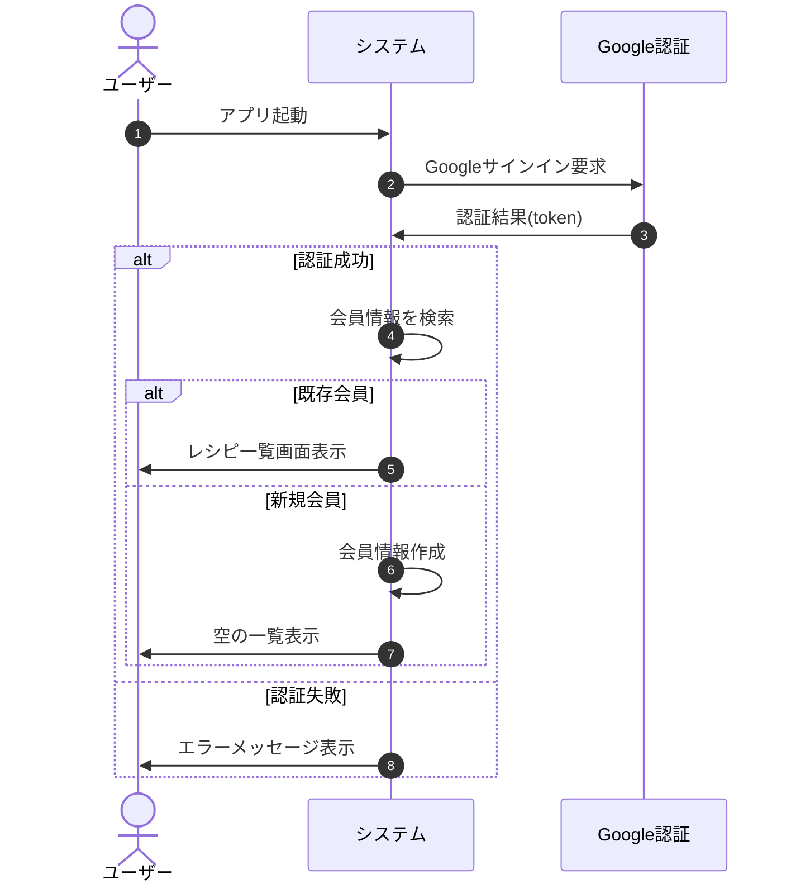
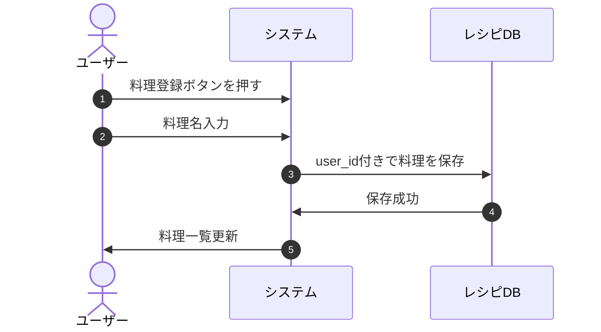
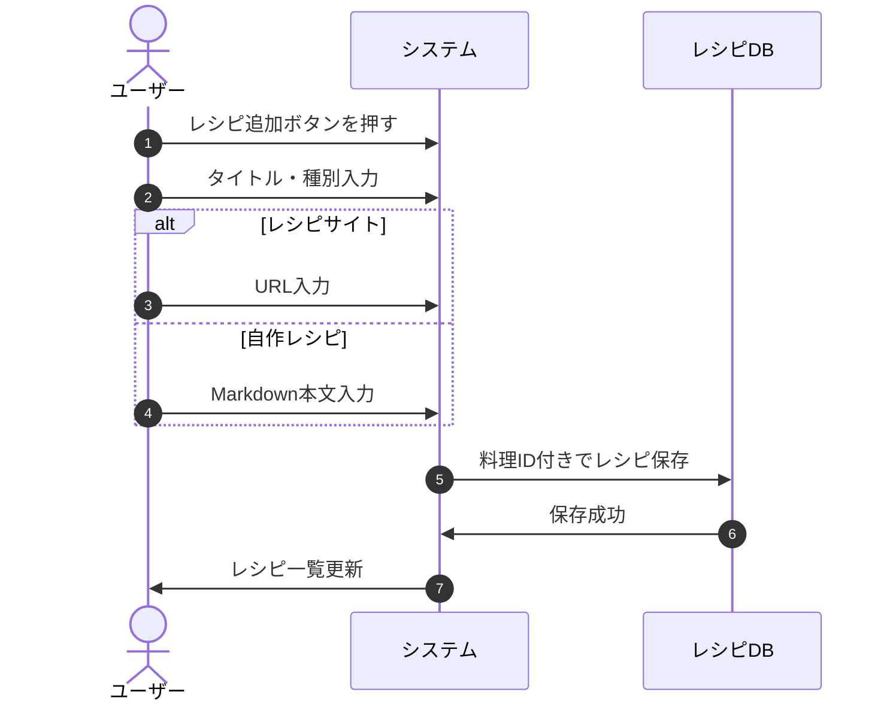
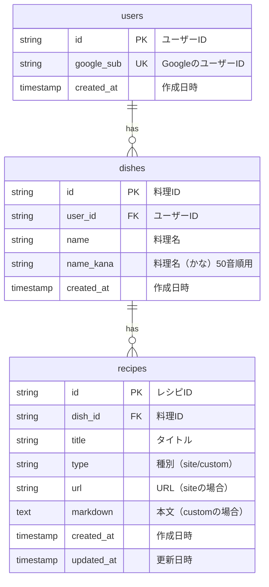

## テーマ
同じ料理に対して、複数のレシピサイトや、レシピを覚えておきたいことがある。それらを登録でき、即座に参照できるようなモバイルアプリが欲しい

## 課題定義

## 要件定義
### 機能要件
優先度
	- P0: 必須
	- P1: ここまで実装することを想定
	- P2: 可能であれば実装したい

#### ログイン機能
- 会員登録(P1)
- Googleアカウントでログイン(P1)
- ログイン状態でのみ、以下の機能が利用できる。
	- 料理名の登録(P0)
	- レシピサイトの登録、削除(P0)
	- 自作レシピの作成、markdownでの編集、削除(P0)

#### レシピ情報
- 料理はレシピを持たない状態でも登録可能とする(P0)
- 1つの料理に対して、複数のレシピを紐づけて管理できる(P0)
- レシピサイトへのリンク(P0)
- 自作レシピの場合は、タイトル、本文(P0)
- 本文には以下のテンプレートあり(P2)
	- レシピ名
	- 材料
	- 作り方
- レシピ一覧は50音順で表示(P0)
- 検索機能(P2)

## 非機能要件
- スマホに対応(P0)
- タブレットに対応(P0)
- PC対応(P2)

## 業務フロー
### ユーザ登録


### 料理登録

### レシピ登録


## 画面要件
### 料理一覧画面
- 目的: 登録済みの料理を確認・追加・検索する
- 要素
	- 料理名リスト
	- 料理追加ボタン
	- 検索バー(P2)
- 操作
	- 料理をタップ -> レシピ一覧画面へ遷移
	- 料理追加 -> モーダルまたは新規画面で料理名入力

### レシピ一覧画面
- 目的: 選択した料理に基づくレシピを一覧表示
- 要素
	- レシピタイトル
	- 種別 (サイト or 自作)
	- URLやMarkdownプレビュー(種別に応じて)
	- レシピ追加ボタン
- 操作
	- レシピタップ -> レシピ詳細画面へ遷移
	- レシピ削除ボタン
	- 新規作成 -> 入力画面

### レシピ詳細
- 要素
	- タイトル種別
	- URL(サイトの場合)
	- Markdown本文(自作レシピの場合)
- 操作
	- 編集・保存
	- 削除

## API要件

### 共通仕様
- ベースURL: `/api/v1`
- 認証ヘッダー: `Authorization: Bearer <jwt>`
- Content-Type: `application/json`

### 認証API

| API          | メソッド | 説明         | 認証 | リクエスト     | レスポンス       |
| ------------ | ---- | ---------- | --- | --------- | ----------- |
| /auth/google | POST | Googleログイン | 不要 | {idToken} | {jwt, user} |

**レスポンス例:**
```json
{
  "jwt": "eyJhbGciOiJIUzI1NiIsInR5cCI6IkpXVCJ9...",
  "user": {
    "id": "user_xxxxx"
  }
}
```
- 既存ユーザー: ユーザー情報を返す
- 新規ユーザー: ユーザーを作成して返す

### 料理API（認証必須）

| API              | メソッド   | 説明           | リクエスト  | レスポンス        |
| ---------------- | ------ | ------------ | ------ | ------------ |
| /dishes          | GET    | 料理一覧取得(50音順) | -      | [{id, name}] |
| /dishes          | POST   | 料理登録         | {name} | {id, name}   |
| /dishes/{dishId} | DELETE | 料理削除         | -      | 204 No Content |

- 削除時、レシピはカスケード削除

### レシピAPI（認証必須）

| API                      | メソッド   | 説明      | リクエスト                          | レスポンス                            |
| ------------------------ | ------ | ------- | ------------------------------ | -------------------------------- |
| /dishes/{dishId}/recipes | GET    | レシピ一覧取得 | -                              | [{id, title, type}]              |
| /dishes/{dishId}/recipes | POST   | レシピ登録   | {title, type, url?, markdown?} | {id}                             |
| /recipes/{recipeId}      | GET    | レシピ詳細取得 | -                              | {id, title, type, url, markdown} |
| /recipes/{recipeId}      | PUT    | レシピ更新   | {title, url?, markdown?}       | 204 No Content                   |
| /recipes/{recipeId}      | DELETE | レシピ削除   | -                              | 204 No Content                   |

- type: `"site"` または `"custom"`
- url: レシピサイトの場合のみ必須
- markdown: 自作レシピの場合のみ必須

### エラーレスポンス

```json
{
  "error": "エラーメッセージ"
}
```

| HTTPステータス | 説明 |
| ----------- | --- |
| 400 | リクエスト不正（バリデーションエラー） |
| 401 | 認証エラー（JWT無効・期限切れ） |
| 403 | 認可エラー（他ユーザーのリソースへのアクセス） |
| 404 | リソースが見つからない |
| 500 | サーバーエラー |

## データベース設計

### ER図



### テーブル定義

#### users（ユーザー）
| カラム | 型 | 制約 | 説明 |
| ----- | -- | --- | --- |
| id | VARCHAR(36) | PK | ユーザーID（UUID） |
| google_sub | VARCHAR(255) | UNIQUE, NOT NULL | GoogleのユーザーID |
| created_at | TIMESTAMP | NOT NULL | 作成日時 |

#### dishes（料理）
| カラム | 型 | 制約 | 説明 |
| ----- | -- | --- | --- |
| id | VARCHAR(36) | PK | 料理ID（UUID） |
| user_id | VARCHAR(36) | FK(users.id), NOT NULL | ユーザーID |
| name | VARCHAR(100) | NOT NULL | 料理名 |
| name_kana | VARCHAR(100) | NOT NULL | 料理名（かな）50音順ソート用 |
| created_at | TIMESTAMP | NOT NULL | 作成日時 |

- `user_id` で **ユーザーごとに料理を分離**
- `name_kana` で50音順ソートを実現

#### recipes（レシピ）
| カラム | 型 | 制約 | 説明 |
| ----- | -- | --- | --- |
| id | VARCHAR(36) | PK | レシピID（UUID） |
| dish_id | VARCHAR(36) | FK(dishes.id) ON DELETE CASCADE, NOT NULL | 料理ID |
| title | VARCHAR(200) | NOT NULL | タイトル |
| type | VARCHAR(10) | NOT NULL | 種別（`site` or `custom`） |
| url | VARCHAR(2048) | NULL | URL（siteの場合） |
| markdown | TEXT | NULL | 本文（customの場合） |
| created_at | TIMESTAMP | NOT NULL | 作成日時 |
| updated_at | TIMESTAMP | NOT NULL | 更新日時 |

- `dish_id` の外部キー制約で **料理削除時にレシピもカスケード削除**
